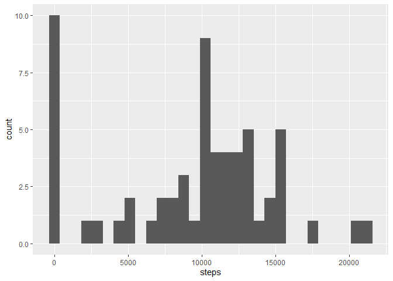
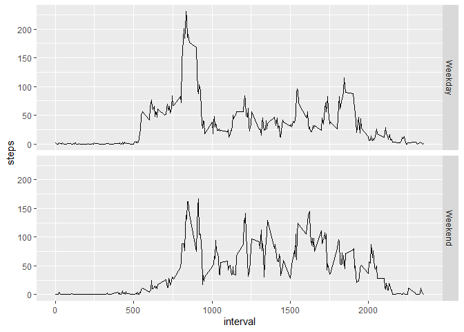

```r
library(readr)
library(dplyr)
```

```
## 
## Attaching package: 'dplyr'
```

```
## The following objects are masked from 'package:stats':
## 
##     filter, lag
```

```
## The following objects are masked from 'package:base':
## 
##     intersect, setdiff, setequal, union
```

```r
library(ggplot2)
```

```
## Warning: package 'ggplot2' was built under R version 4.0.4
```

# Loading and preprocessing the data


```r
activity = read.csv("activity.csv")
activity$date = as.Date(activity$date)
```


# What is mean total number of steps taken per day?

## Calculate the total number of steps taken per day
## Histogram of the total number of steps taken each day


```r
step_date <- activity %>% group_by(date) %>% summarize(steps=sum(steps))
```

```
## `summarise()` ungrouping output (override with `.groups` argument)
```

```r
ggplot(step_date, aes(x=steps)) + geom_histogram()
```

```
## `stat_bin()` using `bins = 30`. Pick better value with `binwidth`.
```

```
## Warning: Removed 8 rows containing non-finite values (stat_bin).
```

<!-- -->

## What is mean total number of steps taken per day?
Mean and median number of steps taken each day:


```r
mean_step <- mean(step_date$steps)
median_step <- median(step_date$steps)
```

Mean step: NA
Median step: NA

## Time series plot of the average number of steps taken

```r
step_interval <- activity %>% group_by(interval) %>% summarize(steps=mean(steps,na.rm=TRUE))
```

```
## `summarise()` ungrouping output (override with `.groups` argument)
```

```r
ggplot(step_interval,aes(x=interval, y=steps)) + geom_line()
```

<!-- -->

```r
max_interval = step_interval[which.max(step_interval$steps),1]
```

The 835  5-minute interval contains the maximum number of steps.

Max steps: 206.1698113

# Imputing missing values

## Total number of missing values in the dataset

A total of 2304 values are missing in the dataset. 

## Missing values are imputed using the mean value of the same 5 minute interval across different dates


```r
activity_imputed <- activity
for (i in 1:length(activity_imputed$steps)){
  if(is.na(activity_imputed[i,"steps"])){
    cor_interval <- activity_imputed[i,"interval"]
    imputed_steps <- mean(activity[activity$interval==cor_interval,"steps"],na.rm=TRUE)
    activity_imputed[i,"steps"] <- as.integer(imputed_steps)
  }
}
```

## Make a histogram of the total number of steps taken each day.


```r
step_date_imputed <- activity_imputed %>% group_by(date) %>% summarize(steps=sum(steps,na.rm=TRUE))
```

```
## `summarise()` ungrouping output (override with `.groups` argument)
```

```r
ggplot(step_date_imputed, aes(x=steps)) + geom_histogram()
```

```
## `stat_bin()` using `bins = 30`. Pick better value with `binwidth`.
```

<!-- -->

## Calculate and report the mean and median total number of steps taken per day. 

```r
mean_step_imputed <- mean(step_date_imputed$steps)
median_step_imputed <- median(step_date_imputed$steps)
```

Mean step with imputed values: 1.074977\times 10^{4}
Median step with imputed values: 10641

# Are there differences in activity patterns between weekdays and weekends?

```r
activity_imputed <- activity_imputed %>% mutate(weekday = weekdays(as.Date(activity_imputed$date)))
activity_imputed <- activity_imputed %>% mutate(weekend = weekday %in% c("Saturday","Sunday"))
activity_imputed$weekend <- if_else(activity_imputed$weekend,"Weekend","Weekday")
activity_imputed$weekend <- factor(activity_imputed$weekend)
steps_weekend <- activity_imputed %>% group_by(weekend, interval) %>% summarize(steps=mean(steps))
```

```
## `summarise()` regrouping output by 'weekend' (override with `.groups` argument)
```

```r
ggplot(steps_weekend,aes(x=interval, y=steps)) + geom_line() + facet_grid(weekend~.)
```

<!-- -->
